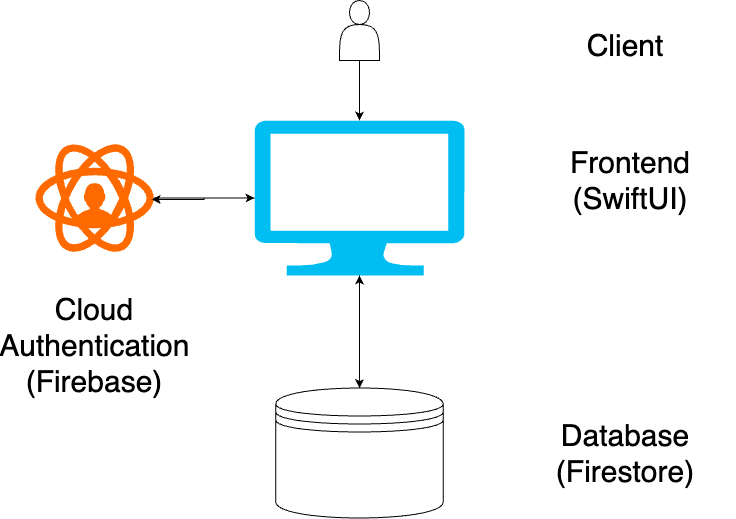

# Design Document

## System Overview

The diagram above depicts the current hierarchy of our application. The client can send information to the frontend by interacting with the application. Once received, the application can send information to our Firebase Authentication service if they want to log in/out or sign up for a new account. Once received, Firebase will send information back to the frontend, indicating a successful/unsuccesful authentication operation. Our database, Firestore, will be queried for different operations once they have logged in. Requests such as changing their profile, matching/unmatching with other users, messages, and many other functionalities all perform operations on the database. Once received, Firestore will either update with the requested information or send an error message.

## Team Decisions

### Using Swift and Firebase
- As a team we decided it would be a good experience for each of us to learn swift and xcode. So far we have come to find that although xcode may have some bugs and unnecessary complexity, support for swift is extremely broad and as long as we can create a good structure and use good standards, it is a great platform.
- Firebase was a unanimous choice for its easy integration and authentication features. So far it has gotten the job done, although we are having slight struggles with finding the best, most efficient way to upload photos.

### User Properties
- We have a list of user properties that we have brainstormed and need to narrow down. Some must include properties are photos, bios, age, name, email, contact info, and then some living preferences.

### Pages
- We decided to provide a few pages, one for profile, one for swiping, one for messages, and then one for matches that will contain people who liked you and the full profile of all your matches.

## User Flows

### Finding a Roommate

#### Log In / Sign Up

#### Profile Set Up

#### Search for Roommates

#### Like/Dislike

#### ...

### Matching

### Messaging

### Setting up/Editing your Profile
