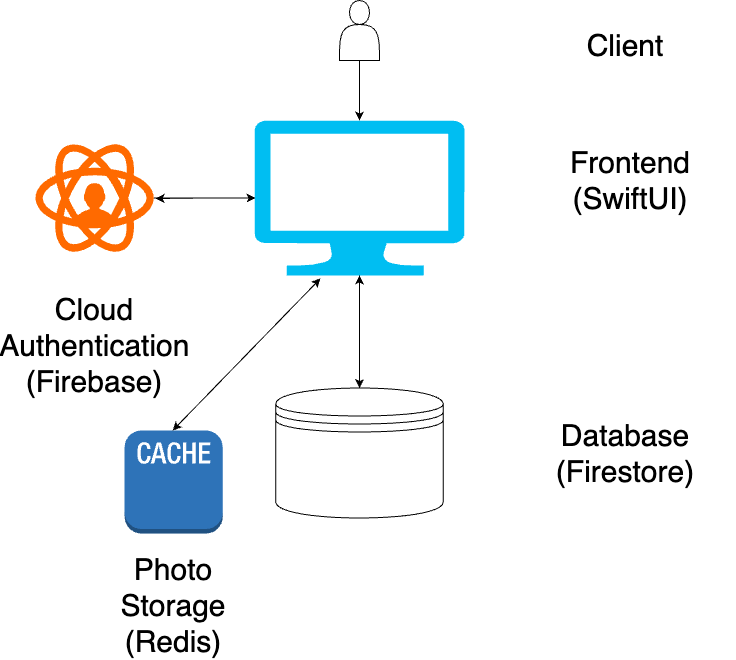

# Design Document

## System Overview

The diagram above depicts the current hierarchy of our application. The client can send information to the frontend by interacting with the application. Once received, the application can send information to our Firebase Authentication service if they want to log in/out or sign up for a new account. Then, Firebase will send information back to the frontend, indicating a successful/unsuccesful authentication operation. Our database, Firestore, will be queried for different operations once they have logged in. Requests such as changing their profile, matching/unmatching with other users, messages, and many other functionalities all perform operations on the database. Upon receieving a request, Firestore will either update with the requested information or send an error message. We also have a cache (Redis) for photo storage because photos need to be rendered everytime a user opens the app. Performing queries everytime on the database for large data is too inefficient when it can be avoided by caching.

## Team Decisions

### Using Swift and Firebase
- As a team we decided it would be a good experience for each of us to learn swift and xcode. So far we have come to find that although xcode may have some bugs and unnecessary complexity, support for swift is extremely broad and as long as we can create a good structure and use good standards, it is a great platform.
- Firebase was a unanimous choice for its easy integration and authentication features. So far it has gotten the job done, although we are having slight struggles with finding the best, most efficient way to upload photos.

### User Properties
- We have a list of user properties that we have brainstormed and need to narrow down. Some must include properties are photos, bios, age, name, email, contact info, and then some living preferences.

### Using Redis for Photos
- As touched on a little bit in our System Overview section, midway through our development process, we had decided to use caching for photo storage. The main reasons for this were because photos take up a lot of storage and querying this photos from Firestore would be inefficient. We did not want to reach our data limit for Firestore and caching allows for much more efficient retrieval of photos. Redis was chosen as our cache because it has a free feature and is one of the more established pre-implmented caches in the development world.

### Pages
- We decided to provide a few pages, one for profile, one for swiping, one for messages, and then one for matches that will contain people who liked you and the full profile of all your matches.

### Swipe View
- We decided to to implement a swipe feature instead of a scroll feature for looking through potential matches. This decision was made based on our A/B testing. When letting our testers interact with these features, they preferred the swipe view more.

### Only Blocking, No Unmatching
- We decided to only implement a block feature because they inherently have the same functionality for our application. When a user unmatches from a match, we infer that they do not like their match. Thus, we will not recommend this user in their swipe view again. Since users can only find new users based on our swipe feature, once a user unmatches from a match, they will never be able to interact with the unmatched user again. This is almost the same concept as blocking. Thus, instead of making our application more complicated with more buttons that have the same functionality, we decided on only a blocking feature.

## User Flows

### Finding a Roommate

#### Log In / Sign Up

The user will be presented with two option upon entering the app: Login and Sign up. They will begin on the login page and if they do not already have an account, there is a button option to switch to sign up. If the user inputs their information and attempts to login, a loading overlay will appear and on a successful login, they will be logged into the app.

#### Profile Set Up

When the User chooses the sign up option, they are presented with two fields for email and password. Once they fill in their desired email and password, they are taken down a profile creation pipeline. This begins with getting the users phone number, if the user decides to cancel it will discard all of their information. Moving on to the next page is their full name age and gender, then school and bio, then roommate preferences. Each of these pages have the option to navigate back to the previous page. At the end they will be presented with a button to create the profile. They will then be taken back to the sign in page, a loading overlay will appear and if the creation is successful, they will be logged into the app.

#### Search for Roommates

When the user is on the homepage, they will be shown user cards with brief information about the shown profile. The user can click on the card to see more information about the profile shown to see more preference details. The user will see two buttons, a red x on the left and a green check mark on the right, allowing them to either like or dislike the profile. Alternatively, they can also swipe on the card to like or dislike.

#### Like/Dislike
If the user likes the profile shown, they can either like or dislike the profile. If they like the profile, it will add it to their likes list in their matches page and switch to the next profile card on the stack. If they do not like the profile, the page will switch to the next profile card on the stack.

#### ...

### Matching

#### Swiping

#### Find a Match

As the user swipes through potential matches depending on if they liked or disliked the profile this information will be stored in the FireStore Database. Once a user has liked a user who has liked them back this will be considered a match and it will be updated accordingly in the Database and the Application. Once a match has been found the user will be prompted with a pop up which informs them that a match has been found.

#### Blocking/Unmatching

If a user wants to prevent all interactions with another user on our application, they can choose to block the other user. To achieve this, they will go to their matches page, click on a user's profile, and click the red button labeled "Block".

### Messaging

If the user wishes to message another user that they've matched with, they can first start by navigating to the "Matches" tab. On this page, users can view their list of matches. They can select a specific match that they wish to message, and this will bring up a profile information page about the selected user. This page will contain a button "Message *Name of User*" that will, when pressed, navigate the user to a page where they can send messages to their match. From here, the user can send/receive messages to and from their match so that they may get to know each other better and plan future steps to officially become roommates.

### Setting up/Editing your Profile
On the profile page, there is a button on the top right side of the screen that will bring up another view that will allow the user to edit their displayed information such as bio, roommate preferences, as well as allow the user to upload a profile picture. This profile picture will be displayed on the user's profile page, as well as be displayed on their profile cards for potential matches.

#### Log In / Sign Up

The user will be presented with two option upon entering the app: Login and Sign up. They will begin on the login page and if they do not already have an account, there is a button option to switch to sign up. If the user inputs their information and attempts to login, a loading overlay will appear and on a successful login, they will be logged into the app.

#### Profile Set Up

When the User chooses the sign up option, they are presented with two fields for email and password. Once they fill in their desired email and password, they are taken down a profile creation pipeline. This begins with getting the users phone number, if the user decides to cancel it will discard all of their information. Moving on to the next page is their full name age and gender, then school and bio, then roommate preferences. Each of these pages have the option to navigate back to the previous page. At the end they will be presented with a button to create the profile. They will then be taken back to the sign in page, a loading overlay will appear and if the creation is successful, they will be logged into the app.

#### Editting Profile

When the user is viewing the profile view they are able to edit their profile using the "Edit" button found on the top right of the view. Once this button is clicked there will be input fields for all the fields associated with the users. These fields will be autofilled with the information the user initially entered when they created the account. The user is able to edit these fields and once satisfied they can click the "Update Profile" button which will update the information in the FireStore database. This information will immediately be reflected for both the current user and all other users viewing this profile.
